 # 🚛 AuthnLogix - AI-Powered-Intelligent-Supply-Chain-SaaS

**AuthnLogix** is a production-ready, full-stack inventory management platform designed for real-time supply chain tracking. 

It features a **Hexagonal Architecture** backend and a **Feature-Sliced Design (FSD)** frontend, ensuring scalability and maintainability. The system is fully containerized using multi-stage Docker builds and served via an Nginx reverse proxy.

---

## ⚡ Key Features

* **🔐 Advanced RBAC:** Multi-role security (Admin, Manager, Driver) with Method-Level protection (`@PreAuthorize`) and conditional UI rendering.
* **📊 Data Intelligence:** Interactive Analytics Dashboard using **Recharts** and custom JPQL Aggregation queries to track inventory value and distribution.
* **🚚 Transactional Logistics:** "Shipment Manager" module handling atomic stock deductions and order tracking to ensure data integrity.
* **📡 Real-Time Synchronization:** WebSocket (STOMP) broadcasts ensure all connected clients see inventory updates instantly without reloading.
* **🛡️ Stateless Security:** Enterprise-grade Authentication using **JWT** and **BCrypt**.
* **🐳 Production DevOps:** Fully Dockerized environment with **Nginx Reverse Proxy** and Multi-Stage builds.
* **💳 SaaS Monetization:** Integrated **Stripe Payment Gateway** for subscription management, handling secure Payment Intents and client-side confirmation.
* **📧 Automated Notifications:** Asynchronous email system using **Spring Mail** for critical alerts (Low Stock) and transactional updates (Shipment Created).

---

## 🏗️ Architecture

The system is built using **Clean Architecture** principles to decouple business logic from frameworks.

### Backend (Spring Boot 3)
We utilize **Hexagonal Architecture (Ports & Adapters)**:
* **Domain Layer:** Pure Java entities (`User`, `Warehouse`, `Product`) with zero framework dependencies.
* **Application Layer:** Service logic and DTOs handling use-cases and validation.
* **Infrastructure Layer:** Adapters for PostgreSQL, REST Controllers, and Security Configurations.

### Frontend (React + TypeScript)
We utilize **Feature-Sliced Design (FSD)**:
* **Layers:** `app`, `pages`, `widgets`, `features`, `entities`, `shared`.
* **Tech:** Vite, Tailwind CSS v3, Zustand (State), TanStack Query (Data Fetching).

### Infrastructure (Docker)
The production build uses a custom network mesh:

```mermaid
graph TD
    %% Nodes
    User((👤 User / Client))
    
    subgraph "Docker Production Host (AWS/Local)"
        Nginx[("🦁 Nginx Gateway<br/>(Port 80)")]
        
        subgraph "Private Network"
            Frontend[("⚛️ React Frontend<br/>(Static Files)")]
            Backend[("☕ Spring Boot API<br/>(Port 8080)")]
            DB[("🐘 PostgreSQL<br/>(Port 5432)")]
            Redis[("🔴 Redis Cache<br/>(Port 6379)")]
            Mail[("kg MailDev<br/>(SMTP)")]
        end
    end

    External_Stripe[("💳 Stripe API")]
    External_Maps[("🌍 OpenStreetMap")]

    %% Connections
    User -- "HTTPS / WSS" --> Nginx
    
    Nginx -- "Serve Static Assets" --> Frontend
    Nginx -- "Proxy /api & /ws" --> Backend
    
    Backend -- "Read/Write Data" --> DB
    Backend -- "Cache/Session" --> Redis
    Backend -- "Send Async Emails" --> Mail
    
    Backend -- "Payment Intents" --> External_Stripe
    Frontend -- "Fetch Tiles" --> External_Maps
    Frontend -- "WebSocket Events" <--> Backend

    %% Styling
    classDef plain fill:#fff,stroke:#333,stroke-width:2px;
    classDef db fill:#e1f5fe,stroke:#0277bd,stroke-width:2px;
    classDef ext fill:#fff3e0,stroke:#ef6c00,stroke-width:2px;
    
    class User,Nginx,Frontend,Backend plain
    class DB,Redis,Mail db
    class External_Stripe,External_Maps ext
```

---

## Category and Technologies

| Category | Technologies                                      |
|----------|-------------------------------------------------|
| Backend  | Java 21, Spring Boot 3, Spring Security, Hibernate (JPA), WebSocket |
| Frontend | React 18, TypeScript, Vite, Tailwind CSS, Zustand, React Query, React Hook Form |
| Database | PostgreSQL 15, Redis 7 (Caching)                 |
| DevOps   | Docker Compose, Nginx (Alpine), Multi-stage Builds |

---
## 🚀 Getting Started

### Prerequisites

- Docker Desktop installed and running.
- Git.

### Option 1: Run in Production Mode (Recommended)

This simulates a real AWS/Cloud deployment using Nginx.

1. Clone the repository:
   git clone https://github.com/AuthnSapuarachchi/-AuthnLogix-AI-Powered-Intelligent-Supply-Chain-SaaS.git
cd authnlogix-saas

2. Build and start containers:
   docker-compose -f docker-compose.prod.yml up --build -d

3. Access the app:

Open your browser and go to [http://localhost](http://localhost) (Runs on Port 80)

**Admin Login:**
- Email: admin@authnlogix.com
- Password: securePassword123

---

### Option 2: Run in Development Mode

If you want to edit code with hot-reloading.

1. Start Infrastructure (DB & Redis):
    docker-compose up -d

2. Start Backend:
- Open backend in IntelliJ IDEA/Eclipse.
- Run `BackendApplication.java`.

3. Start Frontend:

cd frontend
npm install
npm run dev

Access the frontend at [http://localhost:5173](http://localhost:5173)

